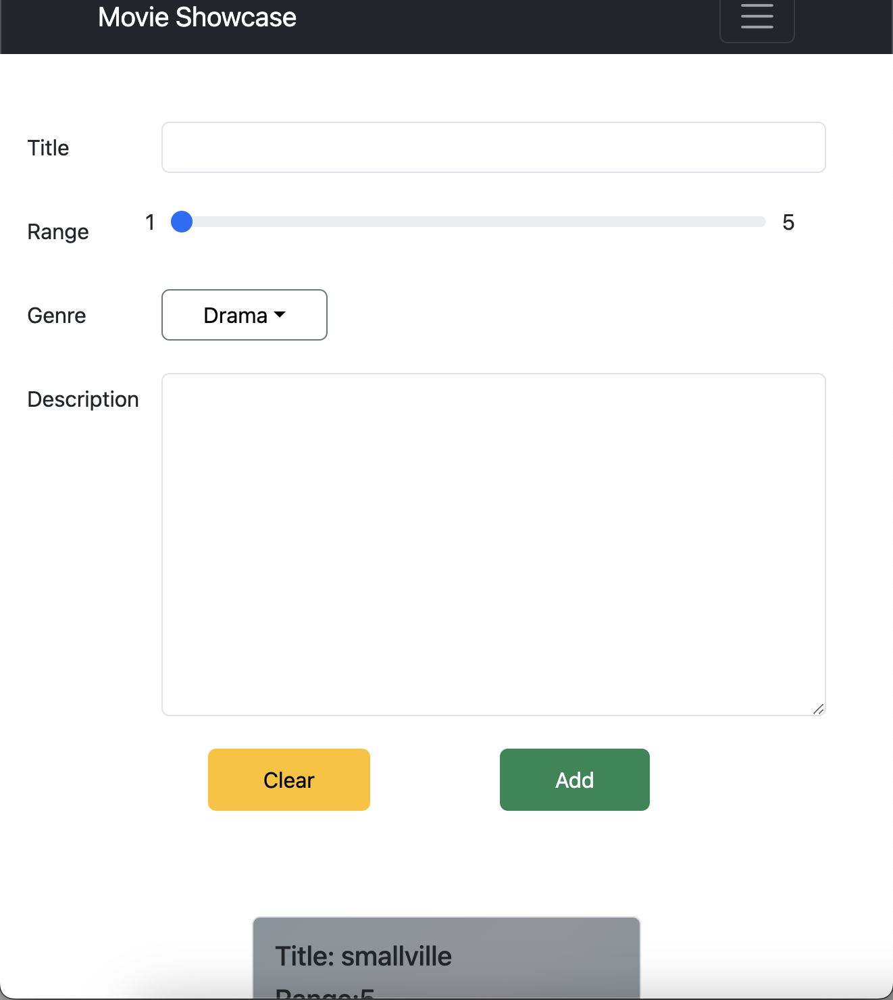

# Movie Showcase


## Responsive



Movie Showcase is a React application that allows users to add and display movies in a responsive grid layout. Each movie card displays the title, rating, genre, and description of the movie.

## Features

- Add new movies with title, rating, genre, and description.
- Responsive design with a grid layout.
- Movie cards display relevant information.
- Uses React and React Bootstrap for styling and layout.

## Technologies Used

- React
- React Bootstrap
- TypeScript
- CSS Grid for responsive layout

## Getting Started

### Prerequisites

- Node.js
- npm or yarn

### Installation

1. Clone the repository:

    ```bash
    git clone https://github.com/yourusername/movieshowcase.git
    cd movieshowcase
    ```

2. Install dependencies:

    ```bash
    npm install
    ```

    or

    ```bash
    yarn install
    ```

### Running the Application

1. Start the development server:

    ```bash
    npm start
    ```

    or

    ```bash
    yarn start
    ```

2. Open your browser and navigate to `http://localhost:3000`.

## Project Structure